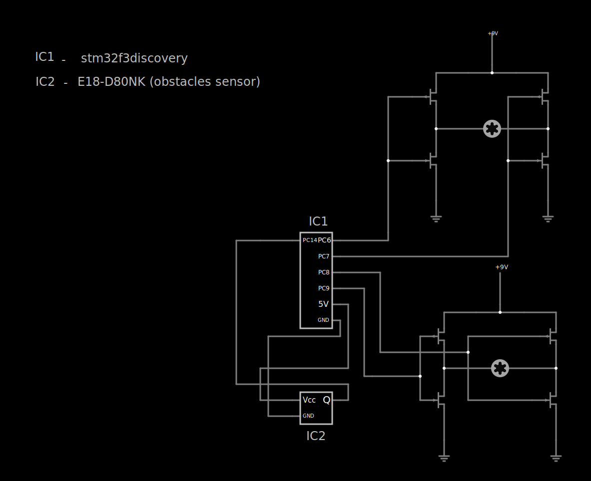
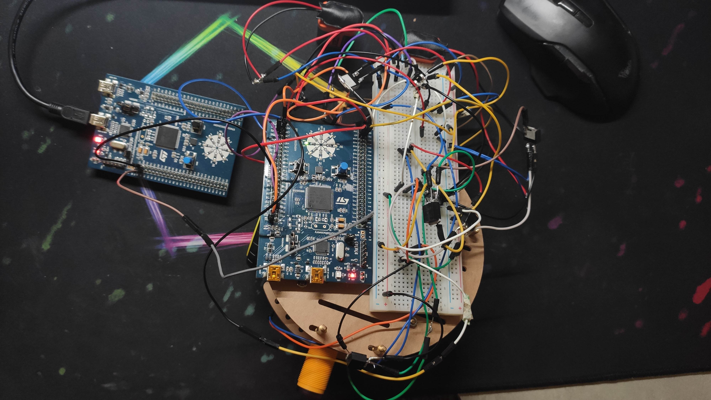
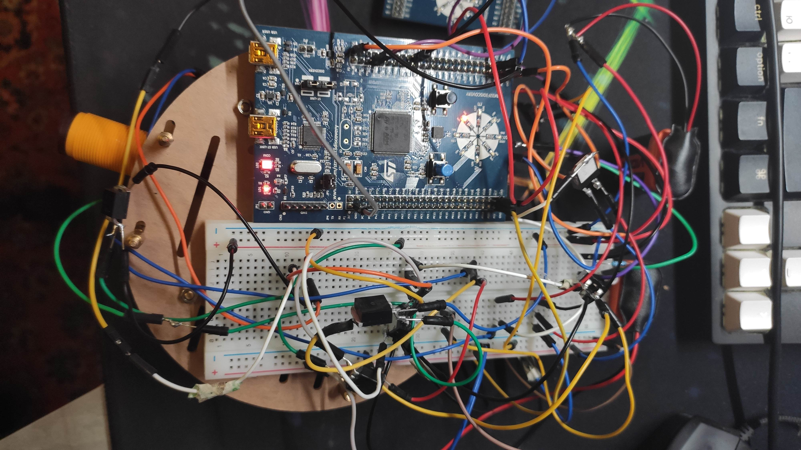
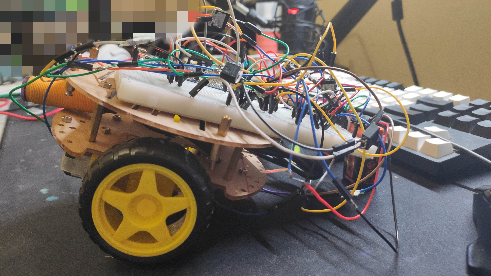
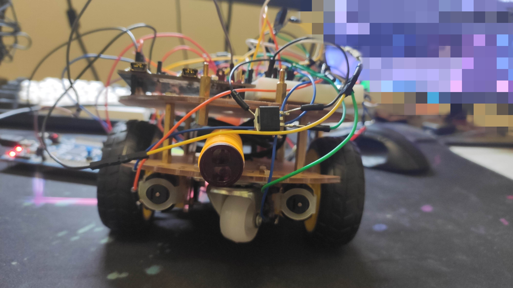

### Idea:
A car that can autonomically detour obstacles

### Based on:
* MCU: Microchip STM32F3discovery
* Obstacles sensor - E18-D80NK
* Circuit: h-bridge made with MOSFET transistors
* Power: DC 5V, 3.3V, 2 x 9V

### Circuitry

### Some car's photos

